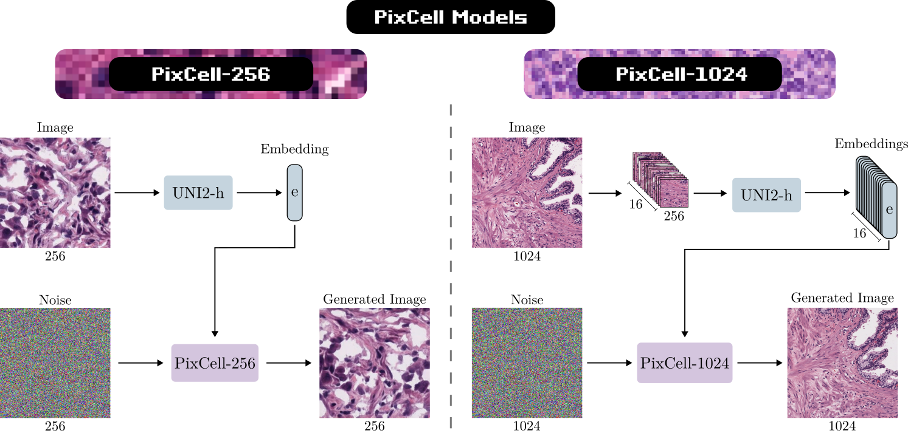

# PixCell: A Pan-Cancer Diffusion Foundation Model

<p align="center">
  <a href="https://arxiv.org/abs/2506.05127"></a> &ensp;
  <a href="https://histodiffusion.github.io/docs/projects/pixcell/"></a> &ensp;
  <a href="https://huggingface.co/StonyBrook-CVLab/PixCell-256"></a> &ensp;
  <a href="https://huggingface.co/StonyBrook-CVLab/PixCell-1024"></a> &ensp;
  <a href="https://huggingface.co/StonyBrook-CVLab/PixCell-original-weights"></a> &ensp;
</p>

---

We present PixCell, the first generative foundation model for digital histopathology. We progressively train our model to generate from 256x256 to 1024x1024 pixel images conditioned on [UNI2-h](https://huggingface.co/MahmoodLab/UNI2-h) embeddings. PixCell achieves state-of-the-art quality in digital pathology image generation and can be seamlessly used to perform targeted data augmentation and generative downstream tasks.





## 🔥 News

- **Nov 2025**: Released the virtual staining models + code.
- **Sep 2025**: Released training + sampling code for PixCell.  
- **June 2025**: Released Hugging Face Diffusers checkpoints for PixCell:
  - [PixCell-256 (Diffusers)](https://huggingface.co/StonyBrook-CVLab/PixCell-256)
  - [PixCell-1024 (Diffusers)](https://huggingface.co/StonyBrook-CVLab/PixCell-1024)

---

## Contents

- [📜 Overview](#-overview)
- [🔧 Dependencies and Installation](#-dependencies-and-installation)
- [📂 Dataset Preparation](#-dataset-preparation)
- [🚀 Training](#-training)
- [🔬 Sampling](#-sampling)
- [🎨 Virtual Staining](#-virtual-staining)
- [📦 Model Zoo](#-model-zoo)
- [📄 Citation](#-citation)

## 🔧 Dependencies and Installation

- Python >= 3.9 (recommend Anaconda or Miniconda)
- PyTorch >= 2.0.1 + CUDA 11.7
```
conda create -n pixcell python=3.9
conda activate pixcell
conda install pytorch==2.0.1 torchvision==0.15.2 torchaudio==2.0.2 pytorch-cuda=11.7 -c pytorch -c nvidia

git clone https://github.com/<your-username>/pixcell.git
cd pixcell
pip install -r requirements.txt
```
---

## 📂 Dataset Preparation

### Patch extraction
We train PixCell on ~70,000 Whole slide images (WSIs) from TCGA, CPTAC, GTeX, etc. WSIs should be preprocessed into patches using DSMIL.

Example structure:

    tcga_diagnostic/
    ├── acc
    │   └── single_1024
    │       ├── TCGA-OR-A5J1-01Z-00-DX1
    │       │   ├── 10_14.jpeg
    │       │   ├── 10_15.jpeg
    │       │   ├── 10_16.jpeg
    │       │   └── 10_17.jpeg
    ...
    cptac/
    gtex/

To support progressive training, we only extract patches at 1024x1024 resolution. Lower resolutions are obtained by extracting crops from the 1024x1024 patches during training. See [diffusion/data/datasets/pan_cancer.py](diffusion/data/datasets/pan_cancer.py) for details.

### Metadata

We index the datasets in an HDF5 file:

    patches/metadata/patch_names_all.hdf5

```
import h5py
f = h5py.File('patches/metadata/patch_names_all.hdf5', 'r')

print(f.keys())
>>> <KeysViewHDF5 ['cptac_1024', 'gtex_1024', 'others_1024', 'sbu_olympus_1024', 'tcga_diagnostic_1024', 'tcga_fresh_frozen_1024']>

print(f['tcga_diagnostic_1024'][:5])
>>> array([b'tcga_diagnostic/lihc/single_1024/TCGA-BC-A8YO-01Z-00-DX1/82_17.jpeg',
       b'tcga_diagnostic/lihc/single_1024/TCGA-BC-A8YO-01Z-00-DX1/26_5.jpeg',
       b'tcga_diagnostic/lihc/single_1024/TCGA-BC-A8YO-01Z-00-DX1/64_11.jpeg',
       b'tcga_diagnostic/lihc/single_1024/TCGA-BC-A8YO-01Z-00-DX1/27_18.jpeg'],
      dtype=object)

```

### Feature Extraction

For each patch, we pre-extract:
- VAE features (sd3vae latents)  
- SSL embeddings (UNI2)

These are stored in the same directory as the images:

    patches/<dataset>/<folder>/<patch>.jpeg
    patches/<dataset>/<folder>/<patch>_sd3_vae.npy
    patches/<dataset>/<folder>/<patch>_uni.npy

Extract features with:

    python tools/extract_features.py --dataset_name tcga_diagnostic --size 256

---

## 🚀 Training

1. Select a config file in `configs/` (examples in `configs/pan_cancer/`).  
   Example: `configs/pan_cancer/pixart_20x_256.py`

2. Launch training:
```
    accelerate launch train_scripts/train_pixcell.py configs/pan_cancer/pixart_20x_256.py \
        --work-dir /path/to/output_dir
```
Options:
- `--work-dir` : output directory for logs + checkpoints  
- `--resume-from` : resume from a checkpoint  
- `--batch-size` : override batch size  

3. Configure accelerate (for multi-GPU/multi-node):
```
    accelerate config
```
---

## 🔄 Progressive Training

PixCell is trained in a **progressive fashion** to improve stability and efficiency (Similar to PixArt-Sigma):  

1. **Stage 1 — Train PixCell-256:**  
   Train the base model on 256×256 patches.  

2. **Stage 2 — Fine-tune PixCell-512:**  
   Initialize from PixCell-256 and fine-tune on 512×512 patches.  

3. **Stage 3 — Fine-tune PixCell-1024:**  
   Initialize from PixCell-512 and fine-tune on 1024×1024 patches.  

Each stage reuses the weights of the previous resolution, allowing faster convergence.  

See the config files in `configs/pan_cancer/` for details.


## 🔬 Sampling

We provide sampling scripts for generating 256×256 (PixCell-256) and 1024×1024 (PixCell-1024) patches.

Example for 256×256 generation:

    python tools/sample_256.py \
        --workdir /path/to/workdir \
        --checkpoint checkpoints/last_ema.ckpt \
        --out_dir samples_256 \
        --n_images 5000 \
        --sampling_steps 20 \
        --guidance_strength 2 \
        --sampling_algo dpm-solver

Outputs:

    samples_256/
    ├── real/   # real patches (for FID evaluation)
    ├── syn/    # generated synthetic patches


Using our [CVPR24 Large image generation](https://histodiffusion.github.io/docs/projects/large_image/) algorithm, we can generate 4K×4K images:

    python tools/sample_4k.py \
        --output_dir samples_4k \
        --num_samples 100 \
        --num_timesteps 20 \
        --guidance_scale 2 \
        --sliding_window_size 64 \
        --gpu_id 0

### Hugging Face Diffusers Sampling

We also provide **Diffusers-compatible checkpoints** and sampling code on Hugging Face:

- [PixCell-256 (Diffusers)](https://huggingface.co/StonyBrook-CVLab/PixCell-256)  
- [PixCell-1024 (Diffusers)](https://huggingface.co/StonyBrook-CVLab/PixCell-1024)  

Follow the instructions on those pages to sample using the `diffusers` API.

---

## 🎨 Virtual Staining

We provide the implementation of our virtual staining algorithm in a Jupyter notebook [`virtual_staining.ipynb`](virtual_staining/virtual_staining.ipynb).

The virtual staining relies on additional model weights (PixCell-1024 LoRA, flow-matching MLP).
For the four stains of the [MIST dataset](https://github.com/lifangda01/AdaptiveSupervisedPatchNCE) (HER2, ER, PR, Ki67) and the [HER2Match dataset](https://zenodo.org/records/15797050), the notebook downloads the necessary models from our [Huggingface repository](https://huggingface.co/StonyBrook-CVLab/pixcell-virtual-staining).

We will be releasing the code to train your own LoRA and flow-matching MLP (soon).

---

## 📦 Model Zoo

| Model         | Resolution | Original Checkpoint | Diffusers Checkpoint |
|---------------|------------|---------------------|----------------------|
| PixCell-256   | 256×256    | [HF original](https://huggingface.co/StonyBrook-CVLab/PixCell-original-weights/blob/main/pixcell_256.ckpt) | [HF Diffusers](https://huggingface.co/StonyBrook-CVLab/PixCell-256) |
| PixCell-1024  | 1024×1024  | [HF Original](https://huggingface.co/StonyBrook-CVLab/PixCell-original-weights/blob/main/pixcell_1024.ckpt) | [HF Diffusers](https://huggingface.co/StonyBrook-CVLab/PixCell-1024) |

---


## 📄 Citation

If you use PixCell in your research, please cite:

    @article{yellapragada2025pixcell,
    title={PixCell: A generative foundation model for digital histopathology images},
    author={Yellapragada, Srikar and Graikos, Alexandros and Li, Zilinghan and Triaridis, Kostas and Belagali, Varun and Kapse, Saarthak and Nandi, Tarak Nath and Madduri, Ravi K and Prasanna, Prateek and Kurc, Tahsin and others},
    journal={arXiv preprint arXiv:2506.05127},
    year={2025}
    }

---

## 🤗 Acknowledgements

PixCell builds on PixArt-Sigma and Diffusers.
